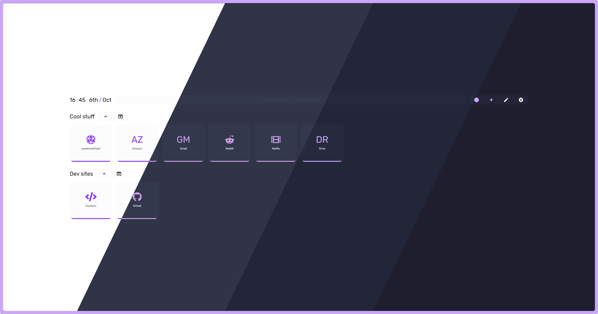

<h3 align="center">
	 
	
	Catppuccin for <a href="https://github.com/zombieFox/nightTab">Nighttab</a>
	
</h3>

	
	
	

	

## Usage

	
🌻 Latte

	<ul>
		<li> Primary Colour: <code>220</code> </li>
		<li> Saturation: <code>16</code> </li>
		<li> Contrast Range: <code>90</code> - <code>100</code> </li>
		<li> Accent colour: Any (https://github.com/catppuccin/catppuccin#-palettes) </li>
	</ul>

	
🪴 Frappé

		<li> Primary Colour: <code>229</code> </li>
		<li> Saturation: <code>19</code> </li>
		<li> Contrast Range: <code>23</code> - <code>50</code> </li>
		<li> Accent colour: Any (https://github.com/catppuccin/catppuccin#-palettes) </li>

	
🌺 Macchiato

		<li> Primary Colour: <code>232</code> </li>
		<li> Saturation: <code>23</code> </li>
		<li> Contrast Range: <code>18</code> - <code>50</code> </li>
		<li> Accent colour: Any (https://github.com/catppuccin/catppuccin#-palettes) </li>

	
🌿 Mocha

		<li> Primary Colour: <code>240</code> </li>
		<li> Saturation: <code>21</code> </li>
		<li> Contrast Range: <code>15</code> - <code>50</code> </li>
		<li> Accent colour: Any (https://github.com/catppuccin/catppuccin#-palettes) </li>

## 💝 Thanks to

- [justTOBBI](https://github.com/justTOBBI)

&nbsp;

	

	Copyright &copy; 2021-present <a href="https://github.com/catppuccin" target="_blank">Catppuccin Org</a>

	

